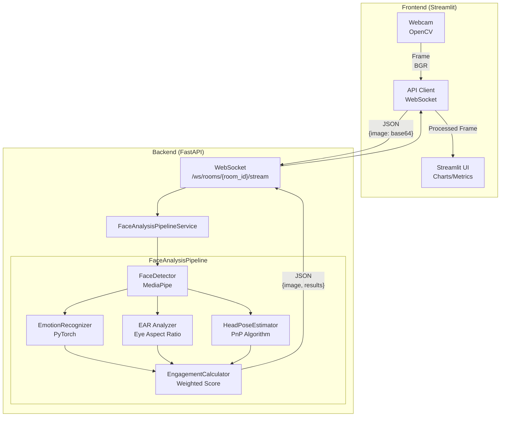

# Real-time Engagement Detection System

[](https://www.python.org/)
[](LICENSE)
[](https://docker.com/)

Real-time facial emotion recognition system with attention tracking. Detects emotions, blinks, and head pose to analyze user engagement through webcam or video upload.


## Quick Start

```bash
git clone https://github.com/FunnyValentain/determining-the-degree-of-involvement.git
cd determining-the-degree-of-involvement
```

### Docker Compose (Recommended)

```bash
docker compose up -d --build
```

> Requires `nvidia-container-toolkit` for CUDA support.

### Manual

#### 1. Install Dependencies

```bash
# Backend
cd backend && pip install -e ".[dev]"

# Frontend
cd ../frontend && pip install -r requirements.txt
```

#### 2. Run Redis Server (required for backend)

```bash
redis-server --requirepass password
```

#### 3. Run Backend

```bash
cd backend
uvicorn app.main:app --reload --host 0.0.0.0 --port 8000
```

#### 4. Run Frontend

```bash
cd frontend
streamlit run engagement_app.py
```

---

## Tech Stack

| Component            | Technology            |
|----------------------|-----------------------|
| Face Detection       | MediaPipe             |
| Emotion Recognition  | PyTorch + EmotiEffLib |
| Video Processing     | OpenCV                |
| Backend              | FastAPI + WebSocket   |
| Frontend             | Streamlit             |
| Caching/Temp Storage | Redis                 |

---

## Project Structure

```
.
├── .env                     # Environment variables (gitignored)
├── .env.example             # Environment template
├── docker-compose.yaml      # Docker orchestration
├── backend/                 # FastAPI backend
│   ├── app/                # Application code
│   │   ├── api/           # API routes
│   │   ├── core/          # Configuration
│   │   ├── db/            # Database
│   │   ├── schemas/       # Pydantic models
│   │   ├── services/      # Business logic
│   │   └── main.py        # Application entry point
│   ├── tests/             # Backend tests
│   ├── scripts/           # Utility scripts
│   ├── pyproject.toml
│   └── Dockerfile
├── frontend/               # Streamlit frontend
│   ├── engagement_app.py  # Main application
│   ├── api_client.py      # WebSocket client
│   ├── styles.css
│   └── requirements.txt
└── tests/                  # Manual tests
    ├── html/              # WebSocket test page
    └── manual/            # Manual test scripts
```

---

## Architecture



### Data Flow

1. **Capture**: Frontend captures video frame from webcam (OpenCV)
2. **Encode**: Frame → JPEG → Base64 → JSON
3. **Process**: Backend WebSocket → Decode → Pipeline → Encode response
4. **Display**: Frontend renders processed frame and metrics

### Processing Pipeline

| Stage | Component           | Technology               |
|-------|---------------------|--------------------------|
| 1     | Face Detection      | MediaPipe Face Detection |
| 2     | Emotion Recognition | PyTorch + EmotiEffLib    |
| 3     | Eye Tracking        | EAR (Eye Aspect Ratio)   |
| 4     | Head Pose           | PnP Algorithm            |
| 5     | Engagement Score    | Weighted Formula         |

### Engagement Formula

```
Engagement = 0.42 × Emotion + 0.33 × Eye_Score + 0.25 × HeadPose_Score
```

---

## Testing

```bash
cd backend
./scripts/test.sh
# or
python -m pytest
```

---

## Linting & Formatting

```bash
cd backend

# Lint
./scripts/lint.sh
# or
ruff check . && mypy . --ignore-missing-imports

# Format
./scripts/format.sh
# or
ruff format .
```

---

## API Documentation

- Health: `http://localhost:8000/health`
- Swagger UI: `http://localhost:8000/docs`

## Testing WebSocket

Open `tests/html/test_ws_stream.html` in browser, click **Connect** then **Start Video**.
